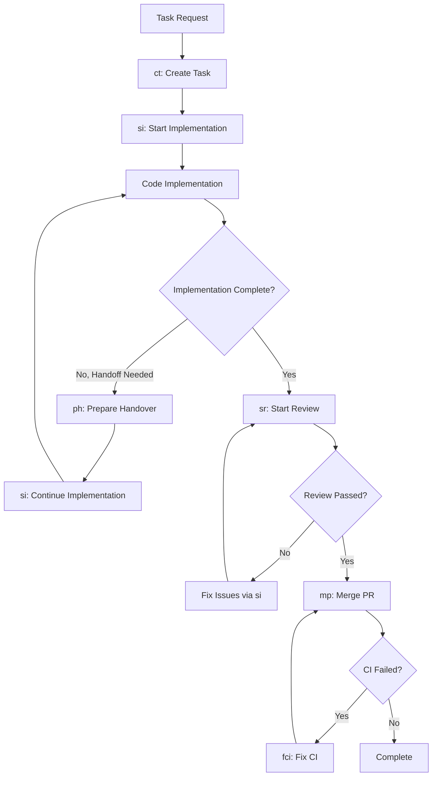

# Claude Commands Directory

This directory contains specialized AI agent commands for the TD Event Telegram Bot project. Each command is a highly specialized agent designed for specific workflow stages in the development lifecycle.

## Quick Reference

| Command | File | Purpose | When to Use |
|---------|------|---------|-------------|
| **ct** | `ct.md` | **C**reate **T**ask | Break down work into detailed implementation tasks |
| **si** | `si.md` | **S**tart **I**mplementation | Begin structured implementation of approved tasks |
| **ph** | `ph.md` | **P**repare **H**andover | Prepare comprehensive handover documentation |
| **sr** | `sr.md` | **S**tart **R**eview | Conduct comprehensive code reviews |
| **mp** | `mp.md` | **M**erge **P**R | Handle pull request merging and cleanup |
| **fci** | `fci.md` | **F**ix **CI** | Fix CI pipeline failures after merge |

## Development Workflow



## Command Details

### **ct** - Create Task
**File**: `ct.md`
**Agent Type**: Task Creation Specialist
**Purpose**: Break down requirements into detailed, implementable tasks with comprehensive approval gates

**Use When**:
- Starting any new development work
- Need structured implementation roadmap
- Planning complex features or fixes
- Converting requirements into technical tasks

**Sub-Agents Used**:
- **plan-reviewer**: Reviews technical decomposition for implementation readiness
- **task-splitter**: Evaluates if task should be split into smaller sub-tasks

**Key Outputs**:
- Detailed task documents in `tasks/` directory with business and technical requirements
- Step-by-step implementation plans with test strategies
- Linear issue creation and tracking setup
- Plan validation and task splitting evaluation

**Approval Gates**:
1. Business Requirements Approval (mandatory user approval)
2. Test Plan Review & Approval (mandatory user approval)
3. Technical Plan Review (plan-reviewer agent validation)
4. Task Splitting Evaluation (task-splitter agent assessment)

### **si** - Start Implementation
**File**: `si.md`
**Agent Type**: Implementation Execution Specialist
**Purpose**: Execute approved task plans with structured Test-Driven Development approach

**Use When**:
- Task plan approved and ready for implementation
- Continuing implementation after addressing code review feedback
- Need structured development workflow with real-time tracking

**Sub-Agents Used**:
- **task-pm-validator**: Validates task documentation completeness before code review
- **create-pr-agent**: Creates GitHub PRs with Linear integration and traceability

**Key Outputs**:
- Code implementation following TDD Red-Green-Refactor cycle
- Real-time progress updates and changelog documentation
- Feature branch with clear commit history
- PR creation with proper formatting and Linear sync

**Quality Requirements**:
- 90%+ test coverage with comprehensive test execution
- All implementation steps completed and documented
- Linear updates at start and completion phases

### **ph** - Prepare Handover
**File**: `ph.md`
**Agent Type**: Handover Preparation Specialist
**Purpose**: Prepare comprehensive handover documentation for task continuation

**Use When**:
- Implementation needs to be paused before completion
- Context window limits require developer handoff
- Time constraints require task transfer to another developer

**Key Outputs**:
- Comprehensive handover documentation in task document
- Current state analysis and progress assessment
- Detailed next steps and continuation instructions
- Linear issue updates with handover status

### **sr** - Start Review
**File**: `sr.md`
**Agent Type**: Code Review Specialist
**Purpose**: Conduct comprehensive code reviews with actual test execution and quality assessment

**Use When**:
- Implementation completed and needs review
- Code quality validation required before merge
- Ensuring requirements compliance and architectural standards

**Key Outputs**:
- Detailed code review documents with categorized issues
- **Critical Requirement**: Actual test execution results (not just code inspection)
- Issue categorization: Critical (must fix), Major (should fix), Minor (nice to fix)
- Linear status updates and approval/rejection decisions

**Quality Standards**:
- Root cause analysis and architectural evaluation
- Security and performance impact assessment
- Complete solution verification checklist coverage
- Professional, constructive feedback with specific examples

### **mp** - Merge PR
**File**: `mp.md`
**Agent Type**: Merge and Cleanup Specialist
**Purpose**: Handle final merge process with documentation updates and task archival

**Use When**:
- Code review shows "✅ APPROVED FOR MERGE"
- All issues resolved and tests passing
- CI pipeline successful and user explicitly approves merge

**Sub-Agents Used**:
- **docs-updater**: Updates all relevant documentation based on task implementation
- **changelog-generator**: Creates changelog entries for completed tasks

**Key Outputs**:
- Documentation updates committed to PR before merge
- Changelog generation with implementation and merge details
- PR merge execution with SHA and timestamp documentation
- Task archival to `tasks/completed/` directory
- Linear issue closure and completion tracking

**Pre-Merge Process**:
1. Documentation updates via docs-updater agent
2. Changelog generation via changelog-generator agent
3. Commit all updates to PR branch before merge
4. Execute merge with appropriate strategy (squash preferred)

### **fci** - Fix CI
**File**: `fci.md`
**Agent Type**: CI Pipeline Specialist
**Purpose**: Fix all CI pipeline failures blocking PR merge while maintaining code quality

**Use When**:
- CI pipeline failed during merge attempt
- Need to resolve linting, typing, testing, or security issues
- Docker build failures or formatting problems

**Key Outputs**:
- Resolution of all CI pipeline failures
- Maintained test coverage (≥80%) and code quality standards
- Security vulnerability fixes and dependency updates
- Docker build validation and smoke testing

**Validation Requirements**:
- Complete CI validation suite execution (matches GitHub Actions)
- Format checking: black, isort compliance
- Type checking: mypy validation with no errors
- Linting: flake8 compliance across codebase
- Security: pip-audit and bandit validation
- Testing: pytest execution with coverage enforcement

## Usage Instructions

### Accessing Commands
Commands are accessed through Claude Code using the specialized agent system:

```bash
# Example usage (through Claude interface):
# "Use the ct command to create a task for user authentication feature"
# "Execute si command to start implementing the approved task"
# "Use ph command to prepare handover for this implementation"
# "Run sr command to review the completed implementation"
# "Execute mp command to merge the approved PR"
# "Use fci command to fix the CI failures"
```

### File Organization
```
.claude/commands/
├── README.md          # This documentation
├── ct.md             # Create task with approval gates
├── si.md             # Start implementation execution
├── ph.md             # Prepare handover documentation
├── sr.md             # Start code review process
├── mp.md             # Merge PR and cleanup
└── fci.md            # Fix CI pipeline failures
```

### Command Integration

Each command is designed to work seamlessly with the others and specialized sub-agents:

1. **Linear Integration**: All commands update Linear issues for project tracking
2. **Task Documentation**: Commands maintain detailed task documents for traceability
3. **Git Integration**: Commands handle branch creation, commits, and PR management
4. **Sub-Agent Coordination**: Commands orchestrate specialized agents for quality validation
5. **Quality Gates**: Each stage has validation criteria before proceeding to next stage

### Best Practices

#### Command Sequencing
- **Start with `ct`**: Always begin with Create Task for structured planning
- **Implement with `si`**: Use Start Implementation for executing approved tasks
- **Handle handoffs with `ph`**: Use Prepare Handover when implementation needs to pause
- **Continue with `si`**: Resume implementation work using the same Start Implementation command
- **Review with `sr`**: Always conduct code review before merging
- **Merge with `mp`**: Use Merge PR for final integration and documentation
- **Fix CI with `fci`**: Address any post-merge CI failures immediately

#### Implementation Flow Options
**Standard Flow**: `ct` → `si` → `sr` → `mp` → (`fci` if needed)
**Handoff Flow**: `ct` → `si` → `ph` → `si` (continuation) → `sr` → `mp` → (`fci` if needed)
**Review Iteration**: `ct` → `si` → `sr` → `si` (address feedback) → `sr` → `mp` → (`fci` if needed)

#### Sub-Agent Integration
- **plan-reviewer** and **task-splitter** automatically invoked during `ct`
- **task-pm-validator** and **create-pr-agent** automatically invoked during `si`
- **docs-updater** and **changelog-generator** automatically invoked during `mp`
- All sub-agents provide validation and quality assurance at key workflow stages

#### Documentation Maintenance
- Commands automatically update task documents with progress and changelog
- Real-time tracking maintained throughout development lifecycle
- All changes linked to business requirements and technical specifications
- Sub-agents ensure documentation consistency and completeness

#### Quality Assurance
- Multiple approval gates in task creation (`ct`) with user and agent validation
- Test-driven development enforced through `si` implementation process
- Comprehensive code review standards automatically applied in `sr`
- CI pipeline validation and fix automation through `fci`

## Sub-Agent Integration Workflow

The workflow commands orchestrate specialized sub-agents to ensure quality and completeness:

### **ct (Create Task)** Sub-Agent Flow
```
User Request → ct Command
    ↓
Business Requirements Approval (User Gate)
    ↓
Test Plan Approval (User Gate)
    ↓
Technical Decomposition
    ↓
plan-reviewer Agent → Technical Validation
    ↓
task-splitter Agent → Complexity Assessment
    ↓
Linear Issue Creation → Ready for Implementation
```

### **si (Start Implementation)** Sub-Agent Flow
```
Approved Task → si Command
    ↓
TDD Implementation (Red-Green-Refactor)
    ↓
Real-time Documentation Updates
    ↓
task-pm-validator Agent → Documentation Validation
    ↓
create-pr-agent Agent → PR Creation & Linear Sync
    ↓
Ready for Code Review
```

### **mp (Merge PR)** Sub-Agent Flow
```
Approved PR → mp Command
    ↓
docs-updater Agent → Documentation Updates
    ↓
changelog-generator Agent → Changelog Generation
    ↓
Commit Updates to PR Branch
    ↓
Execute Merge → Archive Task → Update Linear
```

## Integration with Project Workflow

### Claude Code Integration
These commands are designed to work with Claude Code's agent system:
- Each command is a specialized agent with specific expertise
- Sub-agents provide automated quality validation and documentation
- Commands maintain context and state throughout development lifecycle
- Full integration with project tools (Linear, Git, testing frameworks)

### Project-Specific Configuration
Commands are configured for the TD Event Telegram Bot project:
- Python/Telegram bot specific patterns and practices
- Integration with existing testing and deployment workflows (pytest, mypy, flake8)
- Aligned with project architecture and coding standards
- TDD approach with 90%+ coverage requirements

### Quality Assurance Through Sub-Agents
- **plan-reviewer**: Validates technical approaches before implementation
- **task-splitter**: Prevents overly complex PRs through task decomposition
- **task-pm-validator**: Ensures documentation completeness before review
- **create-pr-agent**: Standardizes PR creation with proper Linear integration
- **docs-updater**: Maintains documentation accuracy post-implementation
- **changelog-generator**: Provides consistent change tracking

---

## Quick Command Reference Card

```
┌─────────────────────────────────────────────────────────────┐
│                     CLAUDE COMMANDS                        │
├─────────────────────────────────────────────────────────────┤
│  ct  │  Create detailed tasks with approval gates          │
│  si  │  Execute TDD implementation with real-time tracking │
│  ph  │  Prepare comprehensive handover documentation       │
│  sr  │  Conduct comprehensive code review with testing     │
│  mp  │  Merge PR with documentation and changelog updates  │
│  fci │  Fix CI pipeline failures post-merge               │
└─────────────────────────────────────────────────────────────┘

Standard Flow:    ct → si → sr → mp → (fci if needed)
Handoff Flow:     ct → si → ph → si → sr → mp → (fci if needed)
Review Iteration: ct → si → sr → si → sr → mp → (fci if needed)

Quality Gates: Business & Test Plan Approval (ct), Technical Review (ct),
               Code Review (sr), Documentation & CI Validation (mp)
Sub-Agents: plan-reviewer, task-splitter, task-pm-validator,
           create-pr-agent, docs-updater, changelog-generator
Integration: All commands update Linear issues and maintain docs with sub-agent validation
```

Use these commands to maintain high-quality, well-documented development processes with automated quality validation and full traceability from requirements through final implementation.