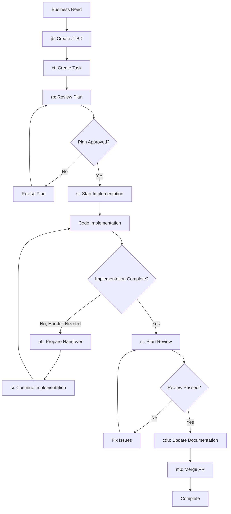

# Claude Commands Directory

This directory contains specialized AI agent commands for the TD Event Telegram Bot project. Each command is a highly specialized agent designed for specific workflow stages in the development lifecycle.

## Quick Reference

| Command | File | Purpose | When to Use |
|---------|------|---------|-------------|
| **jb** | `jb.md` | **J**ob/**B**usiness Context Creation | Create business requirements and user stories |
| **ct** | `ct.md` | **C**reate **T**ask | Break down work into detailed implementation tasks |
| **rp** | `rp.md` | **R**eview **P**lan | Review and validate task plans before implementation |
| **si** | `si.md` | **S**tart **I**mplementation | Begin structured implementation of approved tasks |
| **ci** | `ci.md` | **C**ontinue **I**mplementation | Take over and continue partial implementations |
| **ph** | `ph.md` | **P**repare **H**andover | Prepare comprehensive handover documentation |
| **sr** | `sr.md` | **S**tart **R**eview | Conduct comprehensive code reviews |
| **cdu** | `cdu.md` | **C**omprehensive **D**ocumentation **U**pdate | Execute post-implementation documentation workflow |
| **mp** | `mp.md` | **M**erge **P**R | Handle pull request merging and cleanup |

## Development Workflow



## Command Details

### **jb** - Job/Business Context Creation
**File**: `jb.md`  
**Agent Type**: Business Analysis Specialist  
**Purpose**: Create comprehensive business requirements using Jobs-To-Be-Done framework

**Use When**:
- Starting a new feature or project
- Need to document business value and user impact
- Stakeholders require clear business justification
- Building product roadmap documentation

**Key Outputs**:
- Business context documents
- User story definitions
- Success metrics
- Stakeholder requirements

### **ct** - Create Task
**File**: `ct.md`  
**Agent Type**: Technical Decomposition Specialist  
**Purpose**: Break down business requirements into detailed, implementable tasks

**Use When**:
- Converting business requirements into technical work
- Need structured implementation roadmap
- Planning complex features or fixes
- Setting up development sprints

**Key Outputs**:
- Detailed task documents in `tasks/` directory
- Step-by-step implementation plans
- Acceptance criteria and test strategies
- Linear issue creation and tracking

### **rp** - Review Plan
**File**: `rp.md`  
**Agent Type**: Plan Review Specialist  
**Purpose**: Validate task plans before implementation begins

**Use When**:
- Task document created and needs validation
- Want to prevent implementation issues early
- Ensuring plan quality before development starts
- Need second opinion on technical approach

**Key Outputs**:
- Plan review documents
- Critical issue identification
- Implementation readiness assessment
- Specific improvement recommendations

### **si** - Start Implementation
**File**: `si.md`  
**Agent Type**: Implementation Execution Specialist  
**Purpose**: Execute approved task plans with structured development approach

**Use When**:
- Task plan approved and ready for implementation
- Need structured development workflow
- Want real-time progress tracking
- Following TDD and quality practices

**Key Outputs**:
- Code implementation following task plan
- Real-time progress updates
- Test-driven development execution
- Detailed changelog documentation

### **ci** - Continue Implementation
**File**: `ci.md`  
**Agent Type**: Implementation Continuation Specialist  
**Purpose**: Take over and seamlessly continue implementation started by another developer

**Use When**:
- Another developer started implementation but couldn't complete it
- Need to continue partial implementation after team handoff
- Implementation was paused and needs to resume
- Taking over complex multi-developer tasks

**Key Outputs**:
- Comprehensive handoff analysis and validation
- Seamless continuation of existing implementation approach
- Real-time progress updates maintaining original format
- State verification and gap identification

### **ph** - Prepare Handover
**File**: `ph.md`  
**Agent Type**: Handover Preparation Specialist  
**Purpose**: Systematically prepare comprehensive handover documentation for task continuation

**Use When**:
- Implementation needs to be paused before completion
- Context window limits require developer handoff
- Time constraints require task transfer to another developer
- Implementation encounters blockers requiring specialist help

**Key Outputs**:
- Comprehensive handover documentation in task document
- Current state analysis and progress assessment
- Detailed next steps and continuation instructions
- Linear issue updates with handover status

### **sr** - Start Review
**File**: `sr.md`  
**Agent Type**: Code Review Specialist  
**Purpose**: Conduct comprehensive code reviews of completed implementations

**Use When**:
- Implementation completed and needs review
- Code quality validation required
- Before merging to main branch
- Ensuring requirements compliance

**Key Outputs**:
- Detailed code review documents
- Issue categorization and fix recommendations
- Linear issue status updates
- Approval/rejection decisions

### **cdu** - Comprehensive Documentation Update
**File**: `cdu.md`  
**Agent Type**: Comprehensive Documentation Specialist  
**Purpose**: Execute post-implementation documentation workflow including ADR updates, changelog generation, and critical documentation updates

**Use When**:
- Task implementation completed and tested
- Code review has been passed
- Ready to finalize documentation before PR merge
- Need to ensure all documentation is current and consistent

**Key Outputs**:
- ADR creation and updates via adr-manager agent
- Changelog generation via changelog-generator agent
- Critical documentation updates (README, API docs, deployment guides)
- Documentation consistency validation and cross-reference checks

### **mp** - Merge PR
**File**: `mp.md`  
**Agent Type**: Merge and Cleanup Specialist  
**Purpose**: Handle final merge process and post-merge cleanup

**Use When**:
- Code review approved and documentation updated
- Ready to merge to main branch
- Need cleanup of branches and issues
- Completing development cycle

**Key Outputs**:
- PR merge execution
- Branch cleanup
- Linear issue closure
- Task archival

## Usage Instructions

### Accessing Commands
Commands are accessed through Claude Code using the specialized agent system:

```bash
# Example usage (through Claude interface):
# "Use the ct command to create a task for user authentication feature"
# "Run rp command to review the task I just created"
# "Execute si command to start implementing the approved task"
# "Use ci command to continue the implementation started by John"
```

### File Organization
```
.claude/commands/
├── README.md          # This documentation
├── jb.md             # Job/Business context creation
├── ct.md             # Create task decomposition
├── rp.md             # Review plan validation
├── si.md             # Start implementation execution
├── ci.md             # Continue implementation handoffs
├── ph.md             # Prepare handover documentation
├── sr.md             # Start code review process
├── cdu.md            # Comprehensive documentation update
└── mp.md             # Merge PR and cleanup
```

### Command Integration

Each command is designed to work seamlessly with the others:

1. **Linear Integration**: All commands update Linear issues for project tracking
2. **Task Documentation**: Commands maintain detailed task documents for traceability  
3. **Git Integration**: Commands handle branch creation, commits, and PR management
4. **Quality Gates**: Each stage has approval criteria before proceeding to next stage

### Best Practices

#### Command Sequencing
- **Always** use `rp` (Review Plan) after `ct` (Create Task) before implementation
- **Choose implementation entry point**: Use `si` for fresh start, `ci` for continuing existing work
- **Never skip** code review (`sr`) or documentation update (`cdu`) before merging (`mp`)
- Use `jb` (Job/Business) for all new features requiring business context

#### Implementation Handoffs
- Use `ph` (Prepare Handover) when needing to hand off implementation to another developer
- Use `ci` (Continue Implementation) when taking over from another developer
- Use `si` (Start Implementation) only when beginning fresh implementation
- Always prepare comprehensive handover with `ph` before handing off work
- Always validate previous work state before continuing with `ci`
- Maintain same documentation and quality standards during handoffs

#### Documentation Maintenance
- Commands automatically update task documents with progress
- Real-time changelog tracking maintained throughout development
- All changes linked to business context and requirements

#### Quality Assurance
- Each command includes built-in quality checks
- Test-driven development enforced through task structure
- Code review standards automatically applied

## Command Extensions

### Adding New Commands
When adding new specialized commands:

1. **Naming Convention**: Use 2-letter abbreviations that clearly represent purpose
2. **File Structure**: Follow existing template patterns for consistency
3. **Integration**: Ensure Linear and Git integration compatibility
4. **Documentation**: Update this README with new command details

### Customization
Commands can be customized for project-specific needs:
- Modify templates and workflows in individual command files
- Adjust quality criteria and approval gates
- Configure integration parameters for Linear and Git

## Integration with Project Workflow

### Claude Code Integration
These commands are designed to work with Claude Code's agent system:
- Each command is a specialized agent with specific expertise
- Commands maintain context and state throughout development lifecycle
- Full integration with project tools (Linear, Git, testing frameworks)

### Project-Specific Configuration
Commands are configured for the TD Event Telegram Bot project:
- Python/Telegram bot specific patterns and practices
- Integration with existing testing and deployment workflows
- Aligned with project architecture and coding standards

### Continuous Improvement
Commands evolve based on development experience:
- Templates updated based on project learnings
- Quality criteria refined through practice
- Integration improvements based on team feedback

---

## Quick Command Reference Card

```
┌─────────────────────────────────────────────────────────────┐
│                     CLAUDE COMMANDS                        │
├─────────────────────────────────────────────────────────────┤
│  jb  │  Create business context and user stories           │
│  ct  │  Break down into detailed implementation tasks      │
│  rp  │  Review and validate task plans                     │
│  si  │  Execute structured implementation (fresh start)    │
│  ci  │  Continue implementation (handoff from other dev)   │
│  ph  │  Prepare comprehensive handover documentation       │
│  sr  │  Conduct comprehensive code review                  │
│  cdu │  Execute comprehensive documentation update         │
│  mp  │  Merge PR and handle cleanup                        │
└─────────────────────────────────────────────────────────────┘

Workflow: jb → ct → rp → si/ci → [ph → ci] → sr → cdu → mp
Quality Gates: Plan Review (rp), Code Review (sr) & Documentation Update (cdu) are mandatory
Implementation: Use si for fresh start, ph for handoffs, ci for continuing
Integration: All commands update Linear issues and maintain docs
```

Use these commands to maintain high-quality, well-documented development processes with full traceability from business requirements through final implementation.